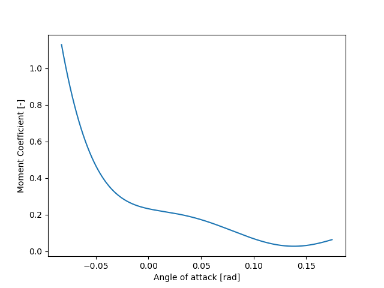
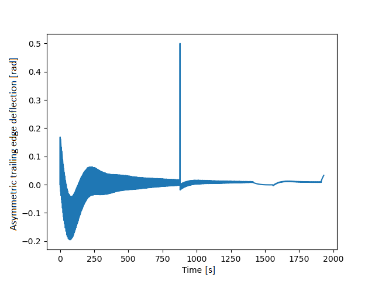
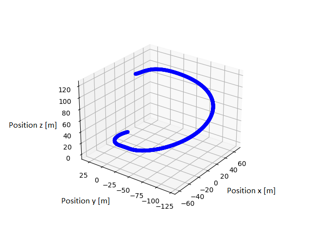
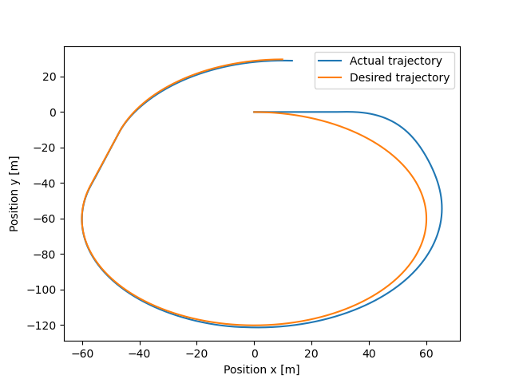
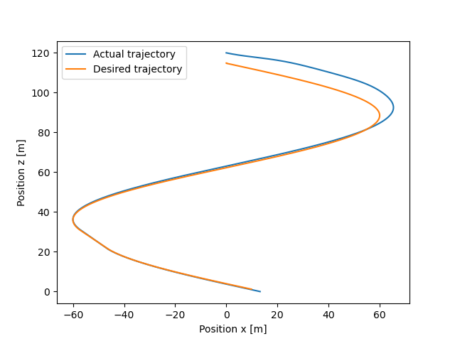

# R2B_CONTROL

## General Information
This simulation was developed for the Return-to-base (R2B) project (within DARE, PRG) in the academic year of 2020-2021. The simulation provides a method for simulating a parafoil-payload system given an easily obtainable set of parafoil-payload parameters. Next to the simulation, a parafoil was produced from scratch, and a payload and steering mechanism developed and produced. These were produced with the intended goal of performing a flight test for model validation.

## Overview of methods

"Parafoil_Dynamics.py" contains the  The methods described in “Basic Analysis of Ram-Air Parachute” by Steven Lingard were used to get from an initial set of parameters to parafoil flight characteristcis (e.g. lift and drag). These methods were extended using the aerodynamics theory in "Fundamentals of aerodynamics" by John Anderson. A method was developed to obtain the equilibrium angle of attack from the moment coefficent vs angle of attack curve (see the figure below) of a certain parafoil cross-section. A simple numerical integration method was used to propagate the state of the parafoil-payload system in an inertial reference frame using a Cartesian coordinate system. 

"Controller.py" features an implementation of the PID control algorithm proposed by B. Rademacher in “In-flight trajectory planning and guidance for autonomous parafoils". This controller uses both the position error and parafoil heading to create a desired asymmetric trailing edge deflection. An example of this control signal over time can be seen in the figure below. Note that actuator dynamics result in an actuator response that is "slower" than the desired signal.

"Dubin_Path.py" contains the method used to generate an optimal control trajectory. These so-called Dubin paths consist of three segments (either turn-straight-turn, or turn-"opposite" turn-turn) and are generated after the parafoil reaches equilibrium flight. This file also contains a method to generate a simulated wind field, as well as a Monte Carlo simulation of the parafoil landing site in this simulated wind field. The image below shows a simulation run using the R2B parafoil system parameters following a Dubin path.

The simulation is run in "Simulation.py" (or "X_38_SIM.py"), and return a number of plots. Especially interesting are the plots demonstrating the capability of the system to follow an optimal Dubin path.

## Case study: X38 parafoil

The simulation was run using an estimated set of X38 parafoil parameters to verify the correct functioning of the program. The estimated set of parameters was found by  test flight data (C. Cerimele et al. “Flight Performance, Aerodynamics, and
Simulation Development for the X-38 Parafoil Test Program"). The simulation results were as follows (actual vs sim): equilibrium vertical velocity: 5.73 m/s vs 6.3 m/s; equilibrium horizontal velocity 17.37 m/s vs 17.8 m/s; angle of attack: 6° vs 6.39°; L/D: 3.0 vs 2.74. With this important set of flight characteristics lying within a range of 10% of the actual value, enough confidence was established to continue using the simulation for control and trajectory studies.

